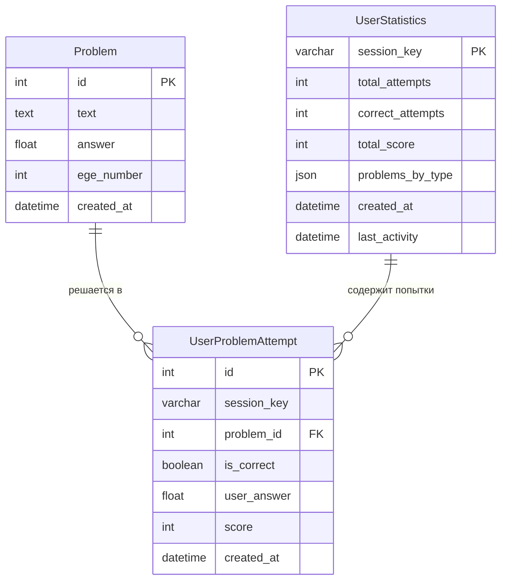

# Техническое задание на проект: ULearnEGE

## 1. Цель проекта
Создание веб-платформы для тренировки решения задач первой части профильного ЕГЭ по математике (задачи 1-12). Сервис позволяет учащимся эффективно готовиться к экзамену через решение случайных вариантов, отработку конкретных типов задач, отслеживание прогресса и сравнение своих результатов с общей статистикой пользователей. Платформа анализирует успехи пользователя, выявляет слабые места и предоставляет визуализацию прогресса.

## 2. Роли пользователей
**Гость (анонимный пользователь):**
- Решение задач через механизм сессий
- Доступ ко всем тренировочным режимам
- Просмотр персональной статистики (на основе сессии)
- Просмотр общей статистики платформы

**Администратор:**
- CRUD операции с задачами
- Модерация контента через Django Admin
- Просмотр агрегированной статистики всех пользователей
- Управление настройками платформы

## 3. Модели данных

### ER-диаграмма базы данных


**Модель 1: Problem (Задача)**
- `id` - уникальный идентификатор (Primary Key)
- `text` - текст задачи (TextField)
- `answer` - правильный ответ (FloatField)
- `ege_number` - номер в ЕГЭ (IntegerField, 1-12)
- `created_at` - дата создания (DateTimeField, auto_now_add=True)

**Модель 2: UserStatistics (Статистика пользователя)**
- `session_key` - ключ сессии (CharField, Primary Key)
- `total_attempts` - общее количество попыток (IntegerField)
- `correct_attempts` - количество правильных решений (IntegerField)
- `total_score` - суммарный балл (IntegerField)
- `problems_by_type` - детальная статистика по типам задач (JSONField)
- `created_at` - дата создания статистики (DateTimeField)
- `last_activity` - последняя активность (DateTimeField)

**Модель 3: UserProblemAttempt (Попытка решения)**
- `id` - уникальный идентификатор (Primary Key)
- `session_key` - ключ сессии пользователя (CharField)
- `problem` - связь с задачей (ForeignKey → Problem)
- `is_correct` - правильность решения (BooleanField)
- `user_answer` - ответ пользователя (FloatField)
- `score` - полученные баллы (IntegerField)
- `created_at` - время решения (DateTimeField)

## 4. Ключевой функционал

### Use Case 1: Решение полного варианта ЕГЭ
**Актор:** Ученик  
**Цель:** Пройти полный тренировочный вариант из 12 задач  
**Основной сценарий:**
1. Пользователь выбирает "Полный вариант"
2. Система генерирует 12 случайных задач (по одной каждого номера 1-12)
3. Пользователь последовательно решает задачи, вводя ответы в поля
4. По завершении пользователь нажимает "Проверить вариант"
5. Система валидирует ответы, вычисляет баллы (1 балл за верный ответ)
6. Отображается детализированный результат с правильными ответами
7. Статистика пользователя обновляется

**Альтернативный сценарий:**
- Если задача не найдена для какого-либо номера → система подставляет заглушку
- Если ответ не введен → засчитывается как неверный

**Алгоритм работы функции `check_variant`:**
```
Вход: request с POST данными, session_key
Выход: редирект на страницу результатов

1. Получить из сессии ID задач текущего варианта
2. Для каждой задачи в варианте:
   а. Извлечь ответ пользователя из request.POST
   б. Преобразовать в float (обработка исключений)
   в. Сравнить с правильным ответом 
   г. Записать результат в UserProblemAttempt
   д. Обновить UserStatistics через метод update_statistics
3. Вычислить общий балл
4. Сохранить результаты в сессии
5. Перенаправить на страницу результатов
```

### Use Case 2: Тренировка по конкретному типу задач
**Актор:** Ученик, желающий отработать слабые места  
**Цель:** Улучшить навыки решения задач определенного типа  
**Основной сценарий:**
1. Пользователь выбирает номер задачи (1-12) на странице "Все номера"
2. Система отображает все доступные задачи этого типа
3. Пользователь решает задачу и вводит ответ
4. Система моментально проверяет ответ
5. Отображается результат проверки
6. Статистика обновляется

**Алгоритм работы функции `check_problem`:**
```
Вход: problem_id, user_answer, ege_number
Выход: JSON с результатом или рендер страницы

1. Получить объект Problem по ID
2. Нормализовать user_answer (замена запятых, обработка дробей)
3. Сравнить с correct_answer
4. Создать запись UserProblemAttempt
5. Обновить UserStatistics
```

### Use Case 3: Анализ статистики и прогресса
**Актор:** Ученик, анализирующий свои результаты  
**Цель:** Оценить прогресс и выявить слабые места  
**Основной сценарий:**
1. Пользователь переходит в раздел "Моя статистика"
2. Система отображает ключевые метрики: точность, средний балл, количество решенных задач
3. Генерируются графики:
   - Точность по типам задач (столбчатая диаграмма)
   - Сравнение с общей статистикой (совмещенная диаграмма)
   - Динамика прогресса (линейный график)
4. Пользователь видит свои сильные и слабые стороны
5. На основе статистики система может рекомендовать задачи для отработки

**Алгоритм генерации графиков:**
```
Вход: данные статистики (UserStatistics, Global Statistics)
Выход: base64-кодированное изображение графика

1. Подготовить данные:
   - Для каждого номера задачи (1-12) вычислить точность пользователя
   - Получить общую точность по платформе
   - Подготовить временные ряды для графика прогресса

2. Создать график с помощью Matplotlib:
   - Настроить размер и стиль графика
   - Построить диаграммы (bar для точности, line для прогресса)
   - Добавить подписи, легенду, сетку
   - Использовать цветовую кодировку

3. Экспорт в base64:
   - Сохранить график в BytesIO буфер
   - Кодировать в base64 строку
   - Передать в шаблон для отображения
```

### Use Case 4: Просмотр общей статистики платформы
**Актор:** Любой посетитель сайта  
**Цель:** Оценить общую эффективность платформы и сложность задач  
**Основной сценарий:**
1. Пользователь переходит в раздел "Общая статистика"
2. Система отображает агрегированные данные:
   - Общее количество пользователей и попыток
   - Средняя точность по платформе
   - Статистика по каждому типу задач
3. Генерируются графики:
   - Общая точность по типам задач
   - Сравнение попыток и правильных решений
   - Сравнение пользователя с общей статистикой
4. Отображаются "самые сложные" и "самые легкие" задачи

### Use Case 5: Управление задачами (администратор)
**Актор:** Администратор платформы  
**Цель:** Управление базой задач и анализ использования  
**Основной сценарий:**
1. Администратор входит в Django Admin панель
2. Просматривает список всех задач
3. Добавляет новые задачи через форму с валидацией
4. Редактирует существующие задачи

## 5. Внешние интеграции / Аналитика

### Библиотеки для анализа данных:
1. **Matplotlib 3.7+** - основная библиотека для визуализации:
   - `matplotlib.pyplot` - построение графиков
   - Генерация столбчатых, линейных и совмещенных диаграмм
   - Автоматическая цветовая кодировка по эффективности
   - Экспорт графиков в base64 для встраивания в HTML

2. **NumPy 1.24+** - математические операции:
   - Статистические вычисления (среднее, медиана, стандартное отклонение)
   - Обработка числовых массивов для графиков

    